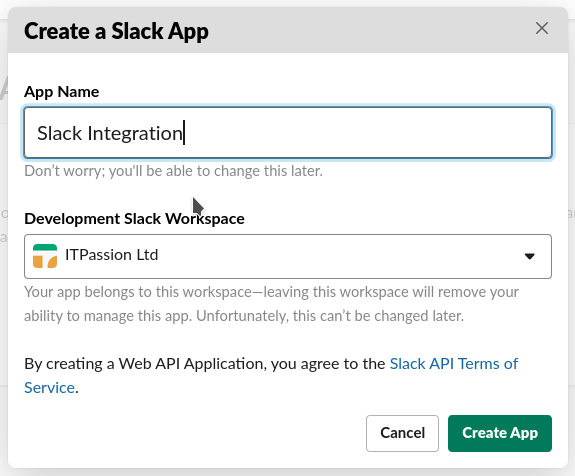

# Slack Integration

## Introduction

This document describes how one can integrate a Laravel App into Slack. It
provides step-by-step details as to what to do and how to make it work together.

## How-To

### Setup a new Laravel application

```shell script
$ laravel new slack-integration
$ composer require laravel/ui
$ php artisan ui vue --auth
$ npm install
```
The above commands will provide an empty, authentication-aware, Laravel
application.

```sql
create schema slack_integration;
```
This will create the `slack_integration` schema in your RDBMS.

Make sure to update the `.env` file accordingly (`DB_DATABASE`) and make sure
the `DB_PASSWORD` is set correctly.

```shell script
php artisan migrate --step
```
I am fuzzy about the ability to rollback each individual migration, so I always
use `--step`.

Start two shells, and run `npm run watch` in one and `php artisan serve` in the
other.

You should be to see the normal Laravel welcome screen:


Go ahead and register, which will ultimately lead to you being logged in.

### Publishing the app as it is

In order to integrate with Slack, we need to have this application available and
accessible via the Internet. Since my home office network is strongly
firewalled, I will publish this application on my Laravel Forge managed server,
by simply adding a new site to Laravel Forge, and setting it to pick this
repository's master branch. I will also create an appropriate database and user,
configure the .env correctly and tell Forge to enable auto-updates.
 
Head over to your trusted DNS service, and add an entry for your new
application:


Create a new site in Laravel Forge:


After a while, the setup of the new site has completed:


Create a new database and a new user:


Now link the new site to your application's code repository in Forge by clicking
on the Git Repository button in the dashboard of your newly created site, and
provide the necessary information:


When the installation is finished, change the Deploy Script to the following:
```shell script
cd /home/forge/www.slack-integration.test.itpassion.com
git pull origin master
composer install --no-interaction --prefer-dist --optimize-autoloader

npm install
npm run prod

( flock -w 10 9 || exit 1
    echo 'Restarting FPM...'; sudo -S service php7.3-fpm reload ) 9>/tmp/fpmlock

if [ -f artisan ]; then
    php artisan migrate --force
fi
```

Edit the environment and make sure the database related settings are correct.

For Slack integration, you will need to have SSL enabled on your site. Forge
makes this very simple, as it can create LetsEncrypt SSL Certificates for any
installed site.


Deploy the application by clicking the "Deploy Now" button in the "Deployment"
section on the site "Apps" dashboard.

When the deployment finished successfully, visit the website you've just set up.
Register a user, and make sure you can login.

### Slack Integration

Slack integration itself is explained
[here](https://api.slack.com/interactivity/slash-commands).
 
First of all, create a Slack application:

 
Then in the application's management dashboard, click the Slash Commands link
and create a new command


 
We do need a request URL where Slack can POST information to. We will use
https://www.slack-integration.test.itpassion.com/slack/slash/command.
Our web application does not have this route configured yet, but we will get
there in a minute.

For now, just provide the required information and click "Save". 

### Setup the route in the Laravel Application

We need a Controller that will to the `/slack/slash/command` route.

```shell script
php artisan make:controller SlashCommandController
```

In your `routes/web.php` include the following route
```php
Route::post('/slack/slash/command', 'SlashCommandController@execute')
    ->name('slashCommand.execute')
    ->middleware('guest');
```

Write the `execute` member of the `SlashCommandController`:
```php
    public function execute(Request $request)
    {
        Log::info(__METHOD__);

        Log::debug('Slack sent us the following information:');
        $input = $request->all();
        foreach($input as $key => $value) {
            Log::debug('"' . $key . '" = "' . $value . '"');
        }

        Log::debug('We are not doing anything with this command at this ' .
            'moment.');

        return response('', 200);
    }
```

Push this change to git, and make sure the application is deployed automatically
by Forge.
